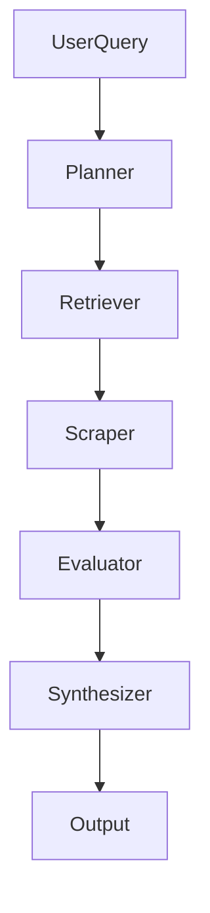
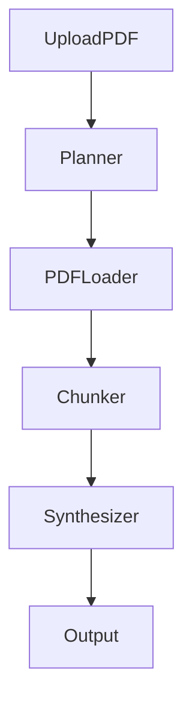

# 🧬 IntelliMesh

**Modular Multi-agent System for AI-Powered Research Automation**

---

## 🚀 Overview

**IntelliMesh** is a lightweight, extensible multi-agent system that automates research workflows using LLM-powered reasoning. Designed to mirror how humans approach complex tasks—**plan, retrieve, evaluate, synthesize**—it turns fragmented data into intelligent, structured, and cited outputs.

Whether handling live web queries or uploaded PDFs, IntelliMesh coordinates a team of specialized agents to produce high-quality answers you can trace, inspect, and build upon.

> 📌 *“IntelliMesh isn’t just an app—it’s full-stack reasoning in action: modular agents, real context flow, and edge-scale LLM integration.”*

 ## 🖥️ Demo

<video src="https://github.com/user-attachments/assets/47bc15e5-2dbd-4eb4-b240-f6b66bcf177e" controls width="600"></video>


## ✨ Key Features

* 🔁 **Dynamic Orchestration** — Planner agent selects optimal pipeline (Web or PDF).
* 🧠 **Modular Agents** — Each agent handles a distinct step in the research workflow.
* 🌐 **Web + PDF Support** — Input can be either a natural language query or research document.
* 🔍 **LLM-Agnostic** — Works with open-source models like LLaMA 3, Mistral 7B, Phi-2.
* 📑 **Cited Markdown Output** — Clean, traceable responses ready for demos or production.
* 🔬 **Evaluation-Ready** — Hooks for precision, recall, citation fidelity, and more.
* 🧩 **Plug-and-Play** — Swap out LLMs, embedding models, or data sources easily.

---


## 🧩 System Architecture

### 🤖 Agent Roles

| Agent                | Purpose                                                    |
| -------------------- | ---------------------------------------------------------- |
| **PlannerAgent**     | Classifies input and routes workflow (PDF vs Web)          |
| **RetrieverAgent**   | Uses Serper API to search and return relevant URLs         |
| **ScraperAgent**     | Downloads and extracts clean text from each URL            |
| **EvaluatorAgent**   | Ranks or filters retrieved text (optional, for noisy data) |
| **PDFLoaderAgent**   | Parses uploaded PDFs and extracts raw content              |
| **ChunkerAgent**     | Splits content and builds vector index (for long docs)     |
| **SynthesizerAgent** | Generates final answer + citations using chosen LLM        |

---

### 🔁 Workflow Diagrams

#### **Web Pipeline**



#### **PDF Pipeline**



---

## 🔧 Why Build My Own?

This project initially began with the idea of using existing agent frameworks like LangChain's AgentExecutor or CrewAI. However, I quickly ran into practical constraints:

* ❌ *Structured prompts (e.g., Thought → Action → Observation) often failed*
* ❌ *Execution was brittle without OpenAI keys or hosted APIs*
* ❌ *LLM outputs were unpredictable without fine-tuning*

> So I  built my own agent and orchestration framework — **lightweight, transparent, and optimized for diverse open-source LLMs.**

This allowed full control over:
- Agent roles and interfaces
- How context flows between modules
- Swapping models like LLaMA 3, Mistral 7B, or even Phi-2 without compatibility issues

The result is a modular, pluggable multi-agent system that runs locally and respects the constraints of edge-scale inference.

---

## 📊 Evaluation & Benchmarking

Benchmarked IntelliMesh against a retriever-only baseline using LLM-as-a-Judge for relevance and faithfulness, plus engineering metrics.

| System     | Relevance | Faithfulness | Latency (s) | Throughput (q/min) | Uptime | Error Rate |
|------------|-----------|--------------|-------------|--------------------|--------|-----------|
| Pipeline   | 0.90      | 0.80         | 30.10       | 1.99               | 100%   | 0%        |
| Baseline   | 0.80      | 0.70         | 28.33       | 2.12               | 100%   | 0%        |

### Agent Utilization

| Agent       | Pipeline (%) | Baseline (%) |
|-------------|--------------|--------------|
| Retriever   | 100.0        | 100.0        |
| Scraper     | 100.0        | 0.0          |
| Evaluator   | 0.0          | 0.0          |
| Chunker     | 0.0          | 100.0        |
| Synthesizer | 0.0          | 100.0        |

**How were these metrics measured?**
- *Relevance & Faithfulness:* LLM-as-a-Judge (1–5 scale, Chain-of-Thought prompting, normalized to 1.0)
- *Latency:* Average time per query
- *Throughput:* Queries per minute (batch mode)
- *Uptime/Error Rate:* % successful runs
- *Agent Utilization:* % of runs each agent was used

> **IntelliMesh outperforms the baseline in both relevance and faithfulness, while maintaining high reliability and throughput.**

## 🕹️ Try It Out

```bash
# 1. Install dependencies
pip install -r requirements.txt

# 2. Add your Serper API key
export SERPER_API_KEY=your_key_here

# 3. Run the app
python app.py
```

* Input a query *or* upload a PDF.
* View detailed step logs and final answer with citations.

---

## 🔍 Example Use Cases

#### 🌐 Web Search

* *“Compare LLaMA 3 vs Mistral 7B”*
  → Pipeline: Retrieve → Scrape → Evaluate → Synthesize
  → Output: Structured comparison from 3+ URLs

* *“Impact of generative AI on research”*
  → Answer includes citations from news, blogs, and academic posts

#### 📄 PDF Upload

* Upload a paper and ask:

  * *“Summarize this.”*
  * *“What’s the methodology?”*
  * *“List all datasets mentioned.”*

---

## 🛠️ Customization Ideas

* Add agents for code analysis, financial data, database queries
* Replace vector DB with FAISS or Weaviate
* Hook in RAG-based grounding or citations rewriter

---

## 🏁 Tech Stack

| Component           | Tech                                          |
| ------------------- | --------------------------------------------- |
| **Core Language**   | Python 3.10+                                  |
| **UI**              | Gradio                                        |
| **Agent Framework** | Custom Python classes (no external agent lib) |
| **Orchestration**   | LangChain (text splitting & pipelines only)   |
| **LLMs, Embeddings**            | HuggingFace Transformers (Mistral, LLaMA)     |
| **Web Retrieval**   | Google Serper API                             |
| **Web Scraping**    | Requests, BeautifulSoup                       |
| **PDF Handling**    | PyPDFLoader/pypdf                            |
| **Vector Search**   | Chroma DB                                     |
| **Output Styling**  | Markdown rendering, Regex formatting          |

---

## 🌟 Why IntelliMesh Stands Out

* ✅ **No Black Boxes** – You see the agents, prompts, and reasoning at every step.
* ✅ **LLM-Agnostic** – Works with open models, on local or cloud infra.
* ✅ **Real Agentic Logic** – Not a wrapper; actual role-based agents with planning + synthesis.


